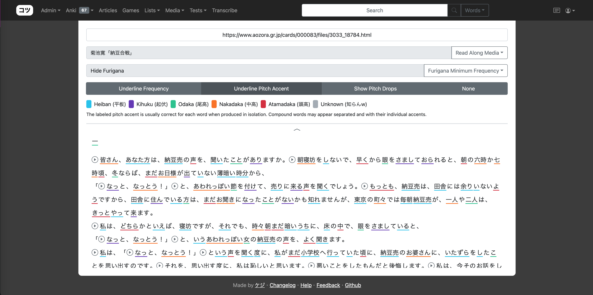

# コツ (kotu)
Hosted at: https://kotu.io

### Features

#### Reader

- Analyzes text with mecab and marks pitch accent / word frequency.
- Click on words to get a popup with definition entries from any dictionaries you have installed.

#### Transcribe

- Add subtitles to videos and collaborate with others to translate form language to language.
- Export subtitles as .srt files.

#### YouTube

- Easily look up words and create flashcards as you watch videos.

